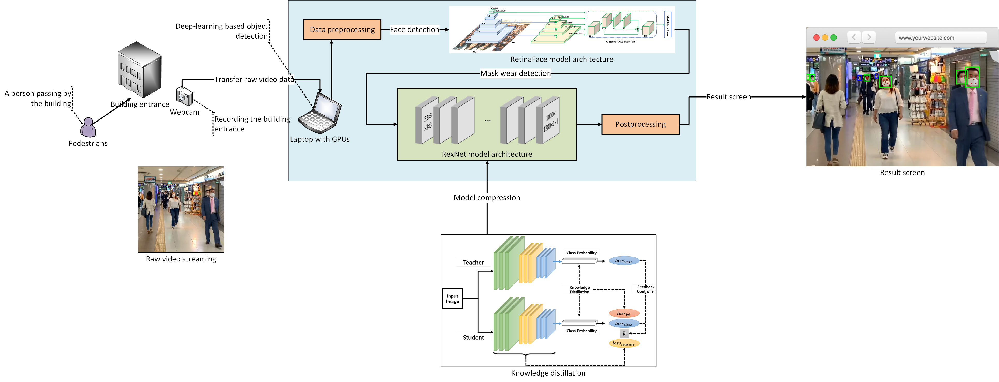

# IMD
Intelligent Mask Detection via Deep Learning Algorithms

## System Architecture

  

  
## Purpose
We thought about how to detect people not wearing masks in various places.  
So, we would like to propose an efficient mask detection system that can also be used on embedded machines with limited resources.  
  
## Environments
H/W : CPU(i5-9400F), RAM(16G), GPU(RTX2070super)  
OS : Ubuntu 18.04  
IDE : Pycharm  
Language : Python 3.7  
Library : OpenCV, Numpy, MXNet etc..  

#### Demonstration Video  
Resolution(640x480)  

### To-Do
- [x] Face detection algorithm
- [x] Mask detection is performed via face detection algorithm
- [ ] Mask detection via Lightweight ReXNet algorithm
- [ ] Fusing face detection and mask detection

#### Reference
- https://github.com/deepinsight/insightface/tree/master/RetinaFace
- https://github.com/clovaai/rexnet
